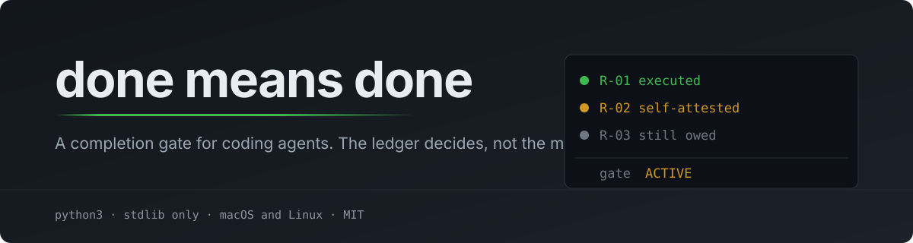

# Done means done

Agents stop early. They finish four items out of five, call a checkpoint a delivery, report a bug instead of fixing it, or mark a test green that never ran an assertion. This skill puts the obligations in a file on disk and refuses to call the work finished until the evidence says so.

Version 0.4.0. The runtime is a single Python CLI, `dmd`, with no dependencies outside the standard library.

Start with [SKILL.md](SKILL.md) for the protocol the agent follows. [Adoption](references/adoption.md) covers installing, upgrading and rolling back. [Validation](evidence/VALIDATION.md) says what was actually run, and [remediations](evidence/REMEDIATIONS.md) lists the defects found and fixed along the way.

## How it decides

Three kinds of record carry the assignment. A requirement is something the operator asked for, and only the operator can withdraw it. A work item is how you plan to deliver one. An acceptance check is what would show it works. Findings sit alongside them: every confirmed defect you notice becomes mandatory work, whether you caused it or found it.

`dmd gate` computes the verdict from those records and the evidence on disk. You ask for it; you never declare it. It needs current coverage against the original request, verified work, unstale evidence, every recorded finding resolved, a real failing baseline behind each regression claim, no open blockers or unknown external outcomes, and a final review of the integrated result.

Evidence is bound to a hash of the actual file contents, including uncommitted and untracked files. Edit the code after a green run and that green goes stale. Yesterday's passing test proves nothing about today's candidate.

`COMPLETE` is one of five results. The others are `ACTIVE`, `BLOCKED`, `PAUSED` and `CANCELLED`, and none of them is delivery.

## What counts as proof

Only a `command` check is machine-verified. It runs, and it passes only on exit zero plus a literal string you declared in advance, within a time and output bound, against an unchanged candidate. An arbitrary zero exit is not enough, because a test file that no longer exists also exits zero.

Manual, review and browser checks are attestations. Some things genuinely cannot be asserted from a command, so they are allowed, but they carry their cost visibly. Each one has to say why no command could observe the behavior. Every report labels them `SELF-ATTESTED` next to the `EXECUTED` ones and counts both at the top. A requirement resting entirely on attestation will not reach `COMPLETE` until the operator records authority for it.

That rule exists because it was broken. Version 0.3.0 accepted a self-written note as acceptance and rendered it identically to a real test run, so an assignment could complete with nothing executed and nothing in the report saying so.

## Install

You need Python 3.10 or newer on macOS or Linux. Git is optional to run, required for the tests. Windows is out of scope, because the locking and process handling are POSIX.

Copy the whole directory. `SKILL.md` alone does nothing.

```bash
python3 --version
python3 -B done-means-done/tests/run.py
mkdir -p "$HOME/.claude/skills"
cp -R done-means-done "$HOME/.claude/skills/done-means-done"
export PATH="$HOME/.claude/skills/done-means-done/bin:$PATH"
dmd --version
```

The destination must not already exist. To upgrade over an installed copy, follow [adoption](references/adoption.md) instead. The `export` only affects the current shell, so add it to your shell startup file or call `python3 "$HOME/.claude/skills/done-means-done/bin/dmd"` in full.

The CLI works immediately. Claude Code hooks are optional and never install themselves. Preview first, then apply:

```bash
python3 "$HOME/.claude/skills/done-means-done/hooks/install.py"
python3 "$HOME/.claude/skills/done-means-done/hooks/install.py" --apply
dmd config --mode enforce
```

Until that last command the mode is `observe`, which records and reports without redirecting anything. The installer merges into your existing settings, backs up what it changes, leaves unrelated hooks alone, and can remove exactly what it added. Start a new session afterward.

Then invoke it:

```text
/done-means-done Complete the following assignment. Fix and report every confirmed
defect discovered in this project, and verify the final integrated result: ...
```

## Layout

| Path | What it holds |
|---|---|
| `SKILL.md` | The protocol the agent reads |
| `bin/dmd`, `dmdlib/` | State, checks, evidence, the gate, reports, hook adapters |
| `hooks/install.py` | Preview, apply and remove managed hook entries |
| `references/` | Command reference, verification, security, recovery, adoption |
| `tests/` | Predicate, CLI, process, hook and installer regressions |
| `examples/local-demo.py` | An isolated red-to-green repair you can run |
| `evidence/` | What was validated, and what was found and fixed |

Task state lives outside the project it verifies, under `~/.local/state/done-means-done/v2/` or wherever `DMD_STATE` points. Reports and handoffs are generated from `task.json`. Do not keep a second checklist by hand, and do not commit state.

## Verify it yourself

```bash
python3 -B tests/run.py            # 178 tests
python3 -B tests/validate_package.py
python3 -B examples/local-demo.py
```

The demo builds a broken fixture in a temporary directory, reproduces the failure, repairs it, proves the regression, then shows a same-size edit with a preserved timestamp invalidating the green. It also refuses a requirement carried only by attestation and completes it once authority is recorded.

## What it does not do

The gate proves the checks you declared and the obligations you recorded. It cannot tell whether your English requirement is a fair reading of what the operator wanted, and coverage cannot catch an ask that both the author and the reviewer missed.

State is local files. Anyone with your filesystem permissions can edit them, so this is auditability rather than tamper resistance. A reviewer identity is a recorded claim and nobody authenticates it.

The hooks only work while the host process is alive. They do not restart anything, schedule anything, fence a remote worker, or override cancellation, permissions or a real infrastructure limit. There is no background service. See [security](references/security.md) and [recovery](references/recovery.md) for the boundaries in detail.

## Credit and license

MIT, and the copyright stays with the PyModel contributors. See [LICENSE](LICENSE).

The protocol and the runtime design come from [PyModel/done-means-done](https://github.com/PyModel/done-means-done), inspected at the commit pinned in [SOURCE.json](SOURCE.json). This is not a byte-identical checkout of that repository. The implementation was rebuilt from the inspected design, and 0.4.0 adds local fixes that were never sent upstream. [CHANGELOG.md](CHANGELOG.md) has the details.
